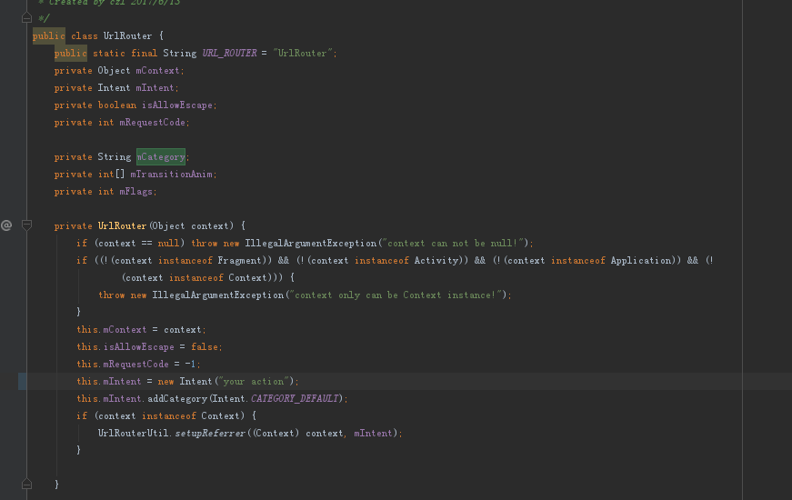

# RouteAndroid
an android route library for page forwarding and data transmission across different component

## Gradle Dependency

com.android.support:support-v4:23.x.x

## page router by transfer bundle params

 UrlRouter.from(context).params(bundle).jump("activity://news/detail");
 

## page router by Animation

UrlRouter.from(context).transitionAnim(R.anim.enterAnim,R.anim.exitAnim).jump("activity://news/detail");
 

## page router startup like startActivityForResult

UrlRouter.from(context).requestCode(requestCode).jump("activity://news/detail");

## page router by custom launch mode

UrlRouter.from(context).flags(flags).jump("activity://news/detail");

## page router allows launch component with different application package
UrlRouter.from(context).allowEscape().jump("activity://news/detail");

## page router fobidden launch component with different application package
UrlRouter.from(context).forbidEscape().jump("activity://news/detail");

## page router statup launch activity
UrlRouter.from(context).jumpToMain("activity://news/detail");

## AndroidManifest.xml configration

<manifest xmlns:android="http://schemas.android.com/apk/res/android"

          package="com.demo">

    <application
        android:allowBackup="false"
        android:label="@string/app_name"
        >
        <activity android:name=".MainActivity">
            <intent-filter>
                <action android:name="android.intent.action.MAIN"/>

                <category android:name="android.intent.category.LAUNCHER"/>
                <category android:name="android.intent.category.DEFAULT"/>

                <data
                    android:host="main"
                    android:path="/main"
                    android:scheme="activity"/>
            </intent-filter>
        </activity>
        <activity
            android:name=".SecondActivity"
            android:exported="false">
            <intent-filter>
                <action android:name="your action"/>
                <category android:name="android.intent.category.DEFAULT"/>
                <data
                    android:host="news"
                    android:path="/detail"
                    android:scheme="activity"/>
            </intent-filter>
        </activity>
    </application>

</manifest>

## page router tips

please modify UrlRouter.java  "this.mIntent = new Intent("your action")",by your own actionName.

## data router

LocalRouter getInstance().registerProvider(String providerName, Provider provider);

LocalRouter getInstance().unRegisterProvider(String providerName);

LocalRouter getInstance().route(Context context, @NonNull RouteRequest routeRequest);

LocalRouter getInstance().asyncRoute(Context context, @NonNull RouteRequest routeRequest, RouteResultListener routeResultListener);
